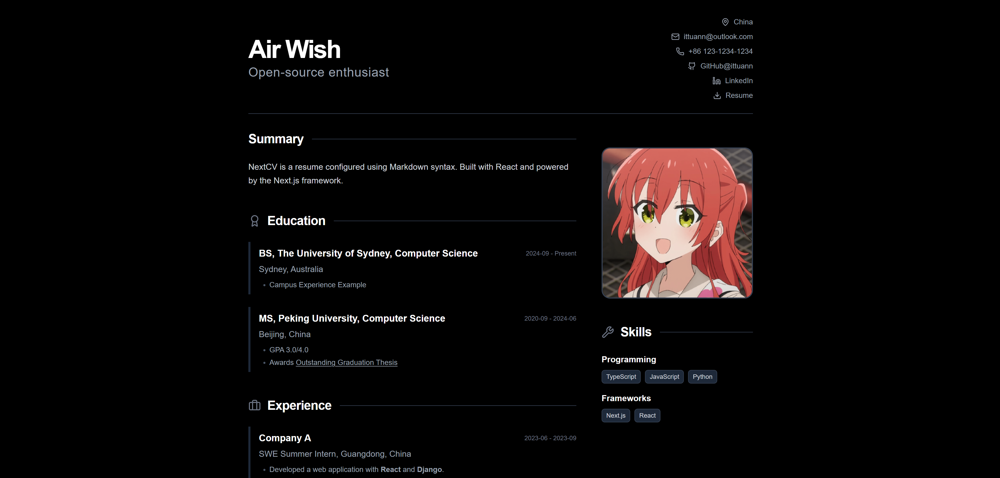

# NextCV

📄 A modern resume website template. Create and manage your resume in Markdown — built with [Tailwind CSS](https://tailwindcss.com/) and [React](https://react.dev/) framework [Next.js](https://nextjs.org/).

## Samples



> [!NOTE]
> Visit [Live Demo](https://next-cv-example.vercel.app/): https://next-cv-example.vercel.app

## Features

- **Markdown Base**: Version control your resume with Git. All content is written in Markdown text.
- **Internationalization**: Supports multiple languages. (TODO)
- **Customizable**: Highly customizable using React.

## Quick Start

- Deploy on Vercel:

[](https://vercel.com/new/clone?repository-url=https%3A%2F%2Fgithub.com%2Fittuann%2FNextCV)

### Local Development

1. Fork and Clone this Repository

- Create [your own fork](https://docs.github.com/get-started/quickstart/fork-a-repo) of this repository to your GitHub account.
- Clone your fork to your local machine

```bash
git clone https://github.com/<your-github-username>/NextCV.git
cd NextCV
```

If you simply wish to explore the repository, you can clone the original repository directly:

```bash
git clone https://github.com/ittuann/NextCV.git
cd NextCV
```

2. Install Dependencies

```bash
pnpm i
```

3. Preview

```bash
pnpm dev
```

To preview the builded static site:

```bash
pnpm build
pnpm serve
```

Then you can open `http://localhost:3000` in your browser.

## Config

Edit the `cv.yaml` file writing in Markdown syntax in the root of the project.

Website will automatically read this file and generate your resume.
